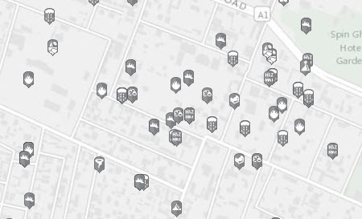

solutions-symbology-data
========================

The purpose of the solutions-symbology-data repository is to share, edit, and develop symbols for the different ArcGIS solutions. This repo does not include standard military symbology such as 2525 and APP. 

## Features

* Source Symbology for the Incident Analysis Template
* More to come

## Sections

* [Requirements](#requirements)
* [Instructions](#instructions)
* [Resources](#resources)
* [Issues](#issues)
* [Contributing](#contributing)
* [Licensing](#licensing)

## Requirements

* ArcGIS Desktop 10.0 (or later)
* If you wish to add to or modify this symbol set you will also need:
    * Scalable Vector Graphic (SVG/.svg) editing software (for example, Inkscape)
    * Inkscape 0.48 (or later) - used by batch script in this repoto convert .svg files to .emf/.png

## Instructions

### General Help

* [New to Github? Get started here.](http://htmlpreview.github.com/?https://github.com/Esri/esri.github.com/blob/master/help/esri-getting-to-know-github.html)

### Using the Source Data

* Download the repository
* In ArcGIS Desktop,use the Style Manager to add the desired style to ArcMap (add the style file from the solutions-symbology-data\data\incident-symbols.
* You may also wish to copy the .style files from each of the repository source folders into your ArcGIS Desktop Style folder (if you wish to install these more permanently).
 
### Modifying the Source Data
   
* Build your own icons in the graphics editor of your choice. 
* Save each symbol as a SVG file (.svg). 
* Ensure that the Inkscape SVG editor/converter is installed
* Modify the [converter .bat command file](./tools/SVGtoPNG.bat)to reflect your local paths
    * NOTE: you may need to change this .bat file to
    * Change the paths to Inkscape and the local data on your machine
    * Change the export image width and height
        * `--export-width=64 --export-height=64`
        * Or remove these options to use the source image size properties (currently 18x18 pixels)
* Run the .bat file in the command prompt to convert your symbols from .SVG to .PNG.
* Create a new style in ArcMap using the Style Manager
* Import each .PNG into ArcMap the desired style as a picture marker symbol.
* Save your new style file.
* (Optional) Make a Pull-Request to include your new/modified files.

## Resources

* [Incident Analysis Template](http://maritime-ops.maps.arcgis.com/home/item.html?id=fd6e2c3272c14826b9781e93580dacfe)
* [Source Data for Military Feature (2525 & APP) Symbology](https://github.com/Esri/military-features-data)
* [Inkscape](www.inkscape.org)

## Issues

Find a bug or want to request a new feature?  Please let us know by submitting an issue.

## Contributing

Esri welcomes contributions from anyone and everyone. Please see our [guidelines for contributing](https://github.com/esri/contributing).

## Licensing

Copyright 2014 Esri

Licensed under the Apache License, Version 2.0 (the "License");
you may not use this file except in compliance with the License.
You may obtain a copy of the License at

   [http://www.apache.org/licenses/LICENSE-2.0](http://www.apache.org/licenses/LICENSE-2.0)

Unless required by applicable law or agreed to in writing, software
distributed under the License is distributed on an "AS IS" BASIS,
WITHOUT WARRANTIES OR CONDITIONS OF ANY KIND, either express or implied.
See the License for the specific language governing permissions and
limitations under the License.

A copy of the license is available in the repository's
[license.txt](license.txt) file.

"Falling" icon used from the [Noun Project by Andrea Novoa](http://www.thenounproject.com/Andiinnoo/) under the
[Creative Commons Attribution 3.0](http://creativecommons.org/licenses/by/3.0/us/) license

Thanks to the other designers for Public Domain Icons used from [The Noun Project](http://thenounproject.com/).

