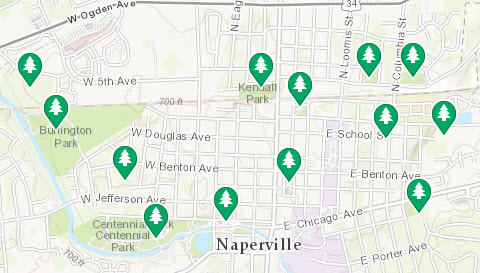

solutions-symbology-data
========================

The purpose of the solutions-symbology-data repository is to share, edit, and develop symbols for the [ArcGIS Solutions](http://solutions.arcgis.com/ "ArcGIS Solutions") (Local and State Government, Emergency Management, Utilities, Military, Intelligence, Telecommunications, and Parks and Gardens).

Check back often for new symbols! 

**Note:** This repo does not include standard military symbology such as 2525 and APP.

## Features

This repo contains symbols designed to be used in ArcMap, ArcGIS Online, ArcGIS Server (map and feature services), and Collector for ArcGIS.

In the repo there are three main folders: 

- Desktop symbols are optimized for editing, basemaps and printed maps.

- Mobile symbols are optimized for field maps.

- Web symbols are optimized for web maps consumed via browsers or web applications.

Within those folders there are another set of folders categorized based on file types.

**Note:** Not all main folders (desktop, mobile, web) contain all the folders described below.

* EMF (Enhanced Metafile)
  *  Symbols were designed to be used in ArcGIS Pro. 
* PNG (Portable Network Graphics)
  * Symbols were designed to be used in ArcGIS Online.
* Style files (style & stylx) 
  * Symbols stored within .style are PNG images that are designed to be used in ArcGIS 10.x.
  * Symbols stored within .stylx are EMF & SVG images that are designed to be used in ArcGIS Pro.
* SVG (Scaleable Vector Graphics)
  * Symbols were designed to be modified in vector editing software such as Inkscape. **Note:** Inkscape 0.48 (or later) was used by batch script in this repo to convert .svg files to .emf/.png. Not all folders has all file type folders. 

The resources used to create the symbols have been acknowledged in the documentation folder.

Tools have been developed to help you convert symbols saved as SVG to EMF which you can use in ArcGIS Pro, and SVG to PNG which you can use in ArcMap 10.x.

## Sections

* [Requirements](#requirements)
* [Instructions](#instructions)
* [Resources](#resources)
* [Issues](#issues)
* [Contributing](#contributing)
* [Licensing](#licensing)

## Requirements

* ArcGIS Desktop 10.x and ArcGIS Pro
* Optionally, if you plan to modify symbols you will need:
    * Scalable Vector Graphic (SVG/.svg) editing software (for example, Inkscape)
    * Inkscape 0.48 (or later) - used by batch script in this repo to convert .svg files to .emf/.png

## Instructions

### General Help

* [New to Github? Get started here.](http://htmlpreview.github.com/?https://github.com/Esri/esri.github.com/blob/master/help/esri-getting-to-know-github.html)

### Using the Symbols

* Download the repository
* You may also wish to copy the .style files from each of the repository source folders into your ArcGIS Desktop Style folder for easy access, or added to a project using ArcGIS Pro.
 
### Modifying the Source Data
   
* Build your own icons in the graphics editor of your choice. 
* Save each symbol as a SVG file (.svg). 
* Ensure that the [Inkscape SVG editor/converter](http://www.inkscape.org) is installed
* Modify one of the [converter .bat command file](./tools) to reflect your local paths and desired settings
    * [SVGtoPNG.bat](./tools/SVGtoPNG.bat) - if creating/importing raster symbology
    * [SVGtoEMF.bat](./tools/SVGtoEMF.bat) - if creating/importing vector symbology
    * **Note:** You will need to change this .bat file to
        * Change the paths to Inkscape and the local data on your machine
        * If using png/raster, you may want to also change the export image width and height
            * `--export-width=64 --export-height=64`
            * Or remove these options to use the source image size properties (currently 18x18 pixels)
* Run the .bat file in the command prompt to convert your symbols from .SVG to .PNG (or .EMF).
* Create a new style in ArcMap using the Style Manager
* Using [a style import utility](https://github.com/williamscraigm/makiArcGISStyle) or ArcMap, import each graphic into the desired style as a picture marker symbol.
    * **Note:** the image sizes/types used in the current set of styles:
    * 18 Point PNG for Incident Symbols
    * 24 Point PNG for Emergency Management Symbols
    * 32 Point EMF for the combined Solutions Symbol Set
* Save your new style file.
* Optionally, submit a pull request that includes your new/modified files.

## Resources

* [Incident Analysis Template](http://maritime-ops.maps.arcgis.com/home/item.html?id=fd6e2c3272c14826b9781e93580dacfe)
* [Blog post further explaining this repository/symbology](http://blogs.esri.com/esri/arcgis/2014/04/17/arcgis-solutions-symbols-now-have-a-repo-on-github/)
* [Source Data for Military Feature (2525 & APP) Symbology](https://github.com/Esri/military-features-data)
* [Inkscape](https://inkscape.org/en/)

## Issues

Find a bug or want to request a new symbol?  Please let us know by submitting an issue.

## Contributing

Esri welcomes contributions from anyone and everyone. Please see our [guidelines for contributing](https://github.com/esri/contributing).

## Licensing

Copyright 2014 Esri

Licensed under the Apache License, Version 2.0 (the "License");
you may not use this file except in compliance with the License.
You may obtain a copy of the License at

   [http://www.apache.org/licenses/LICENSE-2.0](http://www.apache.org/licenses/LICENSE-2.0)

Unless required by applicable law or agreed to in writing, software
distributed under the License is distributed on an "AS IS" BASIS,
WITHOUT WARRANTIES OR CONDITIONS OF ANY KIND, either express or implied.
See the License for the specific language governing permissions and
limitations under the License.

A copy of the license is available in the repository's [license.txt](license.txt) file.

"Falling" icon used from the [Noun Project by Andrea Novoa](http://www.thenounproject.com/Andiinnoo/) under the
[Creative Commons Attribution 3.0](http://creativecommons.org/licenses/by/3.0/us/) license

Thanks to the other designers for Public Domain Icons used from [The Noun Project](http://thenounproject.com/).

